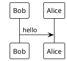

# PUML Server

REST API server for rendering PlantUML diagrams to various formats (SVG, PNG, Text) using Spring Boot.

## Features

- Render PlantUML diagrams to SVG format
- Render PlantUML diagrams to PNG format
- Render PlantUML diagrams to plain text format
- Swagger/OpenAPI documentation with interactive UI
- Request validation with detailed error messages
- Global exception handling
- Default theme matching PlantUML.com style

## Requirements

- Java 17 or higher
- Maven Wrapper (included in project, no need to install Maven separately)
- Graphviz (optional but recommended for some diagram types)

### Installing Graphviz

Graphviz is required for certain PlantUML diagram types (activity diagrams, component diagrams, etc.). If you encounter a "Graphviz Not Found" error, install Graphviz:

**Linux (Debian/Ubuntu):**
```bash
sudo apt-get update
sudo apt-get install graphviz
```

**Linux (RHEL/CentOS):**
```bash
sudo yum install graphviz
```

**Windows:**
Download and install from [https://graphviz.org/download/](https://graphviz.org/download/)

**macOS:**
```bash
brew install graphviz
```

After installation, verify Graphviz is available:
```bash
dot -V
```

## Quick Start

### Build and Run

**Windows:**
```batch
scripts\build-and-run.bat
```

**Linux/Mac:**
```bash
chmod +x scripts/*.sh
./scripts/build-and-run.sh
```

### Using Maven Wrapper

```bash
# Build project
./mvnw clean package
# Windows: mvnw.cmd clean package

# Run application
./mvnw spring-boot:run
# Windows: mvnw.cmd spring-boot:run
```

### Run JAR directly

```bash
# Build first
./mvnw clean package
# Windows: mvnw.cmd clean package

# Run with JVM arguments
java --add-opens java.desktop/com.sun.imageio.plugins.png=ALL-UNNAMED \
     --add-opens java.desktop/com.sun.imageio.plugins.jpeg=ALL-UNNAMED \
     --add-opens java.desktop/com.sun.imageio.plugins.gif=ALL-UNNAMED \
     --add-opens java.desktop/com.sun.imageio.plugins.bmp=ALL-UNNAMED \
     --add-opens java.desktop/com.sun.imageio.plugins.wbmp=ALL-UNNAMED \
     -jar target/puml-server-0.0.4-SNAPSHOT.jar
```

## API Endpoints

### POST /api/v1/render/svg
Renders PlantUML diagram to SVG format.

**Request:**
```json
{
  "puml": "@startuml\n\nBob -> Alice : hello\n\n@enduml"
}
```

**Response:** SVG image (image/svg+xml)

### POST /api/v1/render/png
Renders PlantUML diagram to PNG format.

**Request:**
```json
{
  "puml": "@startuml\n\nBob -> Alice : hello\n\n@enduml"
}
```

**Response:** PNG image (image/png)

### POST /api/v1/render/text
Renders PlantUML diagram to plain text format.

**Request:**
```json
{
  "puml": "@startuml\n\nBob -> Alice : hello\n\n@enduml"
}
```

**Response:** Plain text (text/plain)

## API Documentation

Once the server is running, access the Swagger UI at:

- Swagger UI: http://localhost:7235/swagger-ui.html
- API Docs (JSON): http://localhost:7235/v3/api-docs
- API Docs (YAML): http://localhost:7235/v3/api-docs.yaml

## Configuration

Server runs on port **7235** by default. You can change this in `src/main/resources/application.properties`:

```properties
server.port=7235
```

## Request Validation

The API validates that:
- PUML content is not blank
- PUML content contains `@startuml` and `@enduml` tags

## Error Responses

All errors return JSON format:

```json
{
  "error": "Error Type",
  "message": "Error message or details",
  "status": 400,
  "path": "/api/v1/render/svg",
  "timestamp": "2025-11-17T23:00:00"
}
```

## PlantUML Themes

By default, diagrams are rendered with the same style as PlantUML.com. You can customize the theme by adding theme directives in your PUML code:



Available themes include: `plain`, `cerulean`, `reddress-darkred`, `sketchy-outline`, and more.

## Project Structure

```
puml-server/
├── src/main/java/mew/pumlserver/
│   ├── config/          # Configuration classes
│   ├── controller/      # REST controllers
│   ├── dto/             # Data Transfer Objects
│   ├── exception/       # Exception handlers
│   ├── service/         # Business logic
│   └── PumlServerApplication.java
├── src/main/resources/
│   └── application.properties
├── scripts/             # Build and run scripts
└── pom.xml
```

## Dependencies

- Spring Boot 3.5.7
- PlantUML 8059
- SpringDoc OpenAPI 2.8.14
- Lombok
- Spring Boot Starter Web
- Spring Boot Starter Validation

## Scripts

See `scripts/README.md` for detailed script usage.

## License

See LICENSE file for details.

## Contributing

Contributions are welcome! Please feel free to submit a Pull Request.

