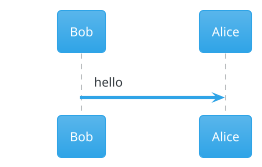
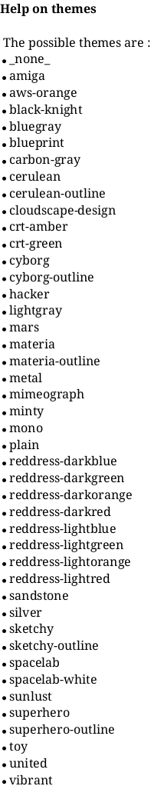
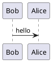

# PUML Server

REST API server for rendering PlantUML diagrams to various formats (SVG, PNG, Text) using Spring Boot.

## Features

- Render PlantUML diagrams to SVG format
- Render PlantUML diagrams to PNG format
- Render PlantUML diagrams to plain text format
- Cache PUML code with unique IDs for later retrieval
- Retrieve cached PUML code by ID
- Swagger/OpenAPI documentation with interactive UI
- Request validation with detailed error messages
- Global exception handling
- Default theme matching PlantUML.com style

## Requirements

- Java 17 or higher
- Maven Wrapper (included in project, no need to install Maven separately)
- Graphviz (optional but recommended for some diagram types)

### Installing Graphviz

Graphviz is required for certain PlantUML diagram types (activity diagrams, component diagrams, etc.). If you encounter a "Graphviz Not Found" error, install Graphviz:

**Linux (Debian/Ubuntu):**
```bash
sudo apt-get update
sudo apt-get install graphviz
```

**Linux (RHEL/CentOS):**
```bash
sudo yum install graphviz
```

**Windows:**
Download and install from [https://graphviz.org/download/](https://graphviz.org/download/)

**macOS:**
```bash
brew install graphviz
```

After installation, verify Graphviz is available:
```bash
dot -V
```

## Quick Start

### Build and Run

**Windows:**
```batch
scripts\build-and-run.bat
```

**Linux/Mac:**
```bash
chmod +x scripts/*.sh
./scripts/build-and-run.sh
```

### Using Maven Wrapper

```bash
# Build project
./mvnw clean package
# Windows: mvnw.cmd clean package

# Run application
./mvnw spring-boot:run
# Windows: mvnw.cmd spring-boot:run
```

### Run JAR directly

```bash
# Build first
./mvnw clean package
# Windows: mvnw.cmd clean package

# Run with JVM arguments
java --add-opens java.desktop/com.sun.imageio.plugins.png=ALL-UNNAMED \
     --add-opens java.desktop/com.sun.imageio.plugins.jpeg=ALL-UNNAMED \
     --add-opens java.desktop/com.sun.imageio.plugins.gif=ALL-UNNAMED \
     --add-opens java.desktop/com.sun.imageio.plugins.bmp=ALL-UNNAMED \
     --add-opens java.desktop/com.sun.imageio.plugins.wbmp=ALL-UNNAMED \
     -jar target/puml-server-0.0.5-SNAPSHOT.jar
```

## API Endpoints

### POST /api/v1/render/svg
Renders PlantUML diagram to SVG format.

**Request:**
```json
{
  "puml": "@startuml\n\nBob -> Alice : hello\n\n@enduml"
}
```

**Response:** SVG image (image/svg+xml)

### POST /api/v1/render/png
Renders PlantUML diagram to PNG format.

**Request:**
```json
{
  "puml": "@startuml\n\nBob -> Alice : hello\n\n@enduml"
}
```

**Response:** PNG image (image/png)

### POST /api/v1/render/text
Renders PlantUML diagram to plain text format.

**Request:**
```json
{
  "puml": "@startuml\n\nBob -> Alice : hello\n\n@enduml"
}
```

**Response:** Plain text (text/plain)

### POST /api/v1/puml
Caches PlantUML source code and returns cache ID. If the same PUML code already exists in cache, returns the existing ID. Otherwise, creates a new cache entry and returns a new ID.

**Request:**
```json
{
  "puml": "@startuml\n\nBob -> Alice : hello\n\n@enduml"
}
```

**Response:**
```json
{
  "id": "550e8400-e29b-41d4-a716-446655440000"
}
```

### GET /api/v1/puml/{id}
Retrieves the PlantUML source code by cache ID. The ID is returned when calling the `/render` API endpoints or `POST /api/v1/puml`.

**Response:**
```json
{
  "puml": "@startuml\n\nBob -> Alice : hello\n\n@enduml"
}
```

### GET /api/v1/render/{type}/{id}/raw
Retrieves cached rendered content by ID and format type (svg, png, or text). The same ID can be used to retrieve SVG, PNG, or Text formats. Content expires after 30 minutes.

**Response:** Rendered content in the requested format (SVG, PNG, or plain text)

## API Documentation

Once the server is running, access the Swagger UI at:

- Swagger UI: http://localhost:7235/swagger-ui.html
- API Docs (JSON): http://localhost:7235/v3/api-docs
- API Docs (YAML): http://localhost:7235/v3/api-docs.yaml

## Configuration

Server runs on port **7235** by default. You can change this in `src/main/resources/application.properties`:

```properties
server.port=7235
```

## Caching

The API uses an in-memory cache to store PUML code and rendered formats:

- **Cache Duration**: 30 minutes
- **Cache Behavior**: 
  - When you call `POST /api/v1/puml` or any `/render` endpoint, the system checks if the same PUML code already exists in cache
  - If found, it returns the existing cache ID
  - If not found, it creates a new cache entry and returns a new ID
- **Cache ID**: A unique UUID that can be used to retrieve:
  - The original PUML code via `GET /api/v1/puml/{id}`
  - Rendered formats (SVG, PNG, Text) via `GET /api/v1/render/{type}/{id}/raw`

## Request Validation

The API validates that:
- PUML content is not blank
- PUML content contains `@startuml` and `@enduml` tags

## Error Responses

All errors return JSON format:

```json
{
  "error": "Error Type",
  "message": "Error message or details",
  "status": 400,
  "path": "/api/v1/render/svg",
  "timestamp": "2025-11-17T23:00:00"
}
```

## PlantUML Themes

By default, diagrams are rendered with the same style as PlantUML.com. You can customize the theme by adding theme directives in your PUML code.

**Note:** Themes are downloaded from the internet when first used. Make sure your server has internet access to use themes.

### Using Themes

To use a theme, add the `!theme` directive at the beginning of your PUML code:



### Checking Available Themes

To see all available themes in your PlantUML version, you can use:



### Popular Themes

Some popular themes include:
- `cerulean` - Light blue theme
- `reddress-darkred` - Dark red theme  
- `sketchy-outline` - Sketchy style
- `spacelab` - Space lab theme
- `united` - United theme
- `dark` - Dark theme

**Note:** Theme names may vary by PlantUML version. Use `help themes` to see the complete list for your version.

### Custom Styling

Instead of themes, you can also use `skinparam` directives for custom styling:



## Project Structure

```
puml-server/
├── src/main/java/mew/pumlserver/
│   ├── config/          # Configuration classes
│   ├── controller/      # REST controllers
│   ├── dto/             # Data Transfer Objects
│   ├── exception/       # Exception handlers
│   ├── service/         # Business logic
│   └── PumlServerApplication.java
├── src/main/resources/
│   └── application.properties
├── scripts/             # Build and run scripts
└── pom.xml
```

## Dependencies

- Spring Boot 3.5.7
- PlantUML 8059
- SpringDoc OpenAPI 2.8.14
- Lombok
- Spring Boot Starter Web
- Spring Boot Starter validation

## License

This project is licensed under the MIT License - see the [LICENSE](LICENSE) file for details.

Copyright (c) 2025 Mew

## Contributing

Contributions are welcome! Please feel free to submit a Pull Request.

